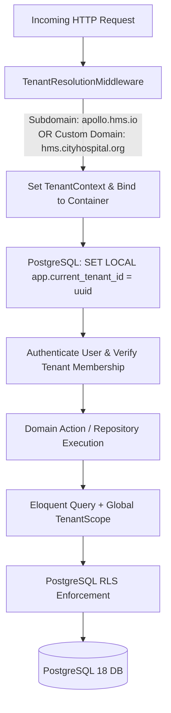
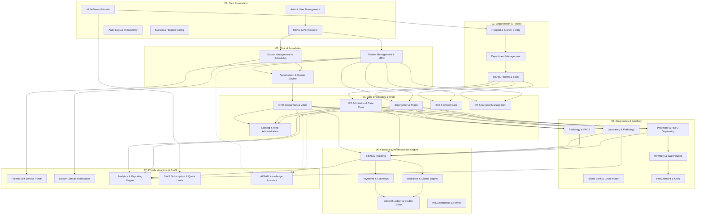
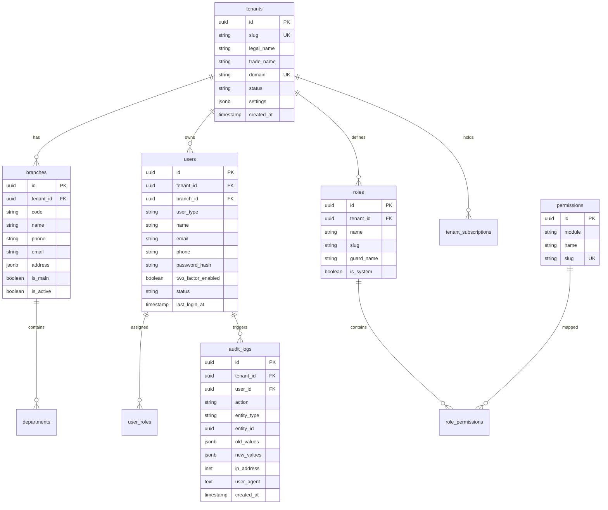
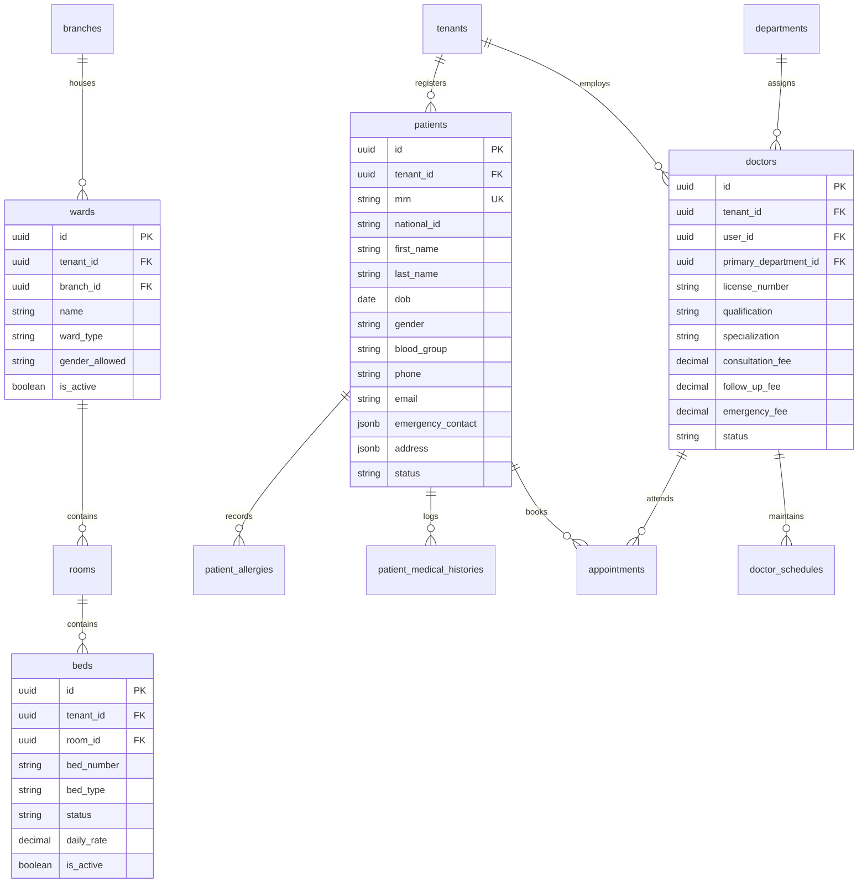
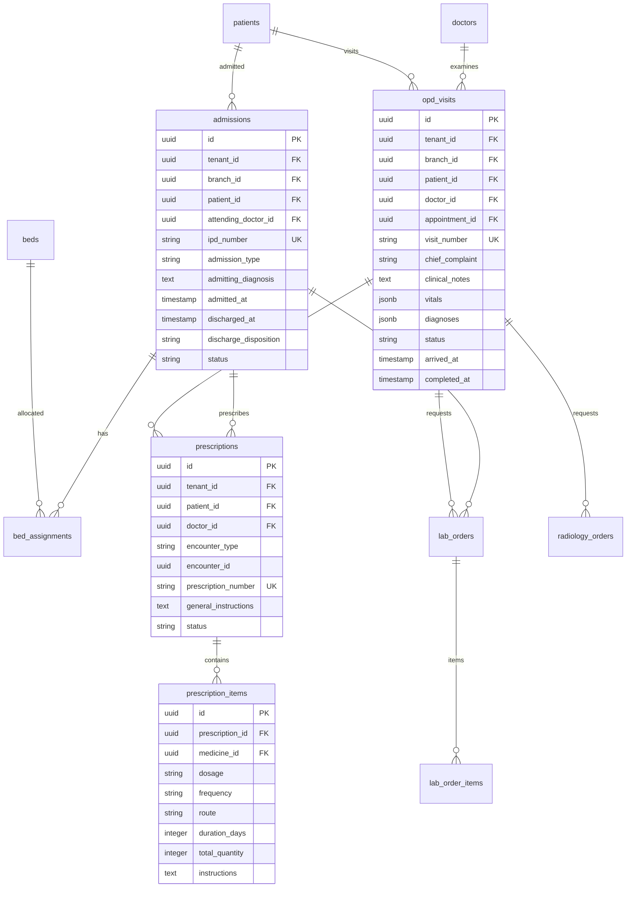
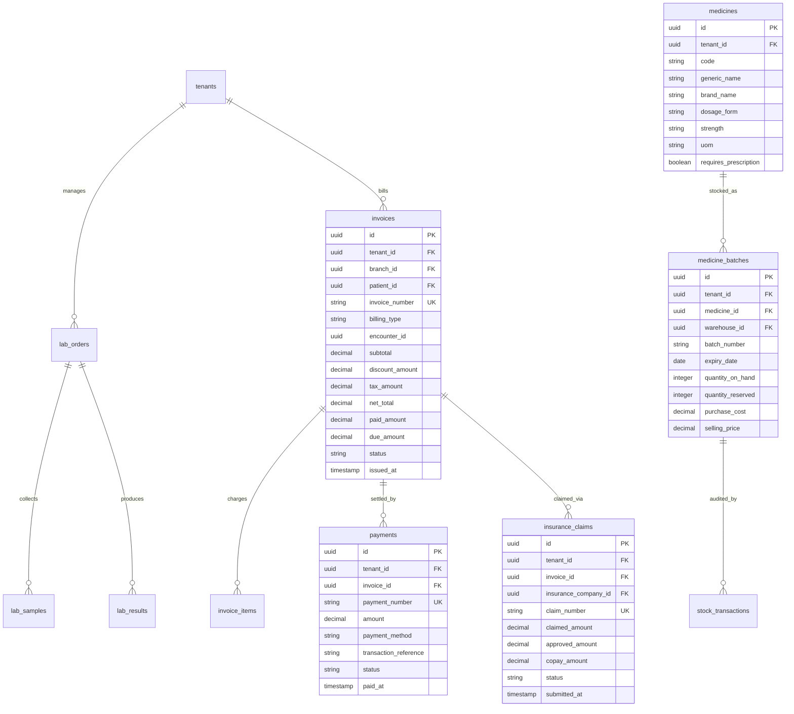

# Enterprise Multi-Tenant Hospital Management SaaS (HMS)
## System Architecture, Database Design & Engineering Specification

---

## 1. Executive Architectural Blueprint

### 1.1 Architectural Philosophy: Domain-Driven Modular Monolith
The Hospital Management System (HMS) is structured as a **Modular Monolith** designed for high cohesion, low coupling, and zero circular dependencies. Rather than jumping prematurely to microservices—which introduces distributed transaction failures, network latency across critical clinical paths, and operational complexity—the system encapsulates business boundaries inside domain modules within Laravel 12/13. 

Every module exposes a distinct public API/Contract and can be extracted into an independent microservice if horizontal scale demands it in the future.

```
+-----------------------------------------------------------------------------------+
|                            PRESENTATION & API LAYER                               |
|   Inertia.js + React 19 (TypeScript)  |  RESTful API v1 (Sanctum / OpenAPI 3.1)   |
|   Role-Tailored Dashboards            |  Webhook Ingestion & Mobile API Gateways  |
+-----------------------------------------------------------------------------------+
                                         |
                                         v
+-----------------------------------------------------------------------------------+
|                        APPLICATION & ORCHESTRATION LAYER                          |
|   Route Middleware (TenantContext, RBAC, ABAC, RateLimit, AuditTrail)             |
|   Form Requests (Zod on Client, Laravel FormRequest on Server)                    |
|   Command / Action Classes (Single-responsibility use cases)                      |
|   Data Transfer Objects (DTOs) with strict typing                                 |
+-----------------------------------------------------------------------------------+
                                         |
                                         v
+-----------------------------------------------------------------------------------+
|                              DOMAIN & CORE SERVICES                               |
|   Domain Models (Eloquent with Tenant Scoping & Soft Deletes)                     |
|   Domain Enums & Value Objects (MRN, Money, Temperature, BloodPressure, ICD-10)   |
|   Domain Events & Listeners (AppointmentBooked, SampleCollected, InvoicePaid)     |
|   State Machine Engines (Finite State Machines for Encounter, Bed, Rx, Lab, Bill) |
+-----------------------------------------------------------------------------------+
                                         |
                                         v
+-----------------------------------------------------------------------------------+
|                            INFRASTRUCTURE & PERSISTENCE                           |
|   PostgreSQL 18 (UUIDv7, Composite Tenant Indexes, RLS, Full-Text Search)         |
|   Redis (Cache, Session, Laravel Horizon Queues, Real-time WebSockets/Reverb)   |
|   S3-Compatible Storage (MinIO / AWS S3 for Prescriptions, Lab PDFs, DICOM)       |
|   External Gateways (Payment Gateways, SMS, WhatsApp, Email, PACS/Orthanc)        |
+-----------------------------------------------------------------------------------+
```

---

## 2. Multi-Tenant Architecture & Data Isolation

### 2.1 Isolation Strategy: Hybrid Tenant Partitioning
Healthcare compliance requires rigorous data boundaries. The platform adopts a **Multi-Tenant Hybrid Model**:
1. **Default Mode (Shared Database, Logical Scoping with Defense-in-Depth)**:
   - Every tenant-scoped entity carries a `tenant_id` (UUIDv7).
   - An immutable request context (`TenantContext`) is initialized via subdomain/domain/header middleware.
   - Eloquent models implement a universal `BelongsToTenant` trait applying a global scope: `WHERE tenant_id = ?`.
   - **Database-Level Defense-in-Depth**: PostgreSQL Row Level Security (RLS) policies are active on PostgreSQL, binding queries to `SET LOCAL app.current_tenant_id = '...'` to prevent any leaked query or direct SQL injection from accessing neighbor data.
2. **Enterprise Dedicated Mode (Database-per-Tenant)**:
   - For high-volume enterprise hospitals requiring physical separation, the `TenantDatabaseManager` dynamically switches the connection configuration at runtime using Laravel's dynamic connection switching without rewriting business code.



### 2.2 Organization Hierarchy & Multi-Branch Topology
```
Platform / SaaS Owner (Super Admin)
   │
   └── Organization / Tenant (e.g., Apollo Health Group)
         │
         ├── Branch 1 (Main Hospital - Downtown)
         │     ├── Departments (Cardiology, Radiology, Pharmacy, ICU)
         │     ├── Wards, Rooms & Beds
         │     ├── Doctors, Nurses & Staff Members
         │     └── Warehouses & Stock Locations
         │
         └── Branch 2 (Diagnostic Center - Uptown)
               ├── Departments (Laboratory, Imaging, OPD)
               └── Staff & Cash Counters
```

---

## 3. High-Level Module Dependency Graph

Modules follow strict acyclic dependency rules. Low-level modules never depend on high-level ones.



---

## 4. Entity Relationship Diagram (ERD) & Schema Design

Below is the database architecture across core domains, utilizing **UUIDv7** (time-ordered UUIDs for high B-Tree insert performance), strict Foreign Keys with `ON DELETE RESTRICT` for healthcare safety, and check constraints.

### 4.1 ERD: Tenancy, Auth & RBAC


### 4.2 ERD: Clinical Foundation (Patients, Doctors, Facilities)


### 4.3 ERD: Clinical Encounters (OPD, IPD, Prescriptions, Orders)


### 4.4 ERD: Diagnostics, Pharmacy, Inventory & Billing


---

## 5. Core Database Schema Specifications (PostgreSQL 18 DDL Standards)

### Key Architectural Guidelines
1. **Primary Keys**: Always `UUIDv7` (or PostgreSQL native `gen_random_uuid()` / application-generated ordered UUIDv7) for optimal spatial locality in index trees.
2. **Monetary Values**: Always `NUMERIC(15, 2)` or `NUMERIC(18, 4)`. No floating points.
3. **Temporal Values**: Always `TIMESTAMPTZ` (UTC).
4. **Tenant Scoping**: Every table has a composite index `(tenant_id, id)` and `(tenant_id, created_at DESC)`.
5. **State Machine Safety**: Check constraints enforce valid statuses and state flows.

```sql
-- Enable necessary extensions
CREATE EXTENSION IF NOT EXISTS "pgcrypto";
CREATE EXTENSION IF NOT EXISTS "uuid-ossp";

-- Core Tenants
CREATE TABLE tenants (
    id UUID PRIMARY KEY DEFAULT gen_random_uuid(),
    slug VARCHAR(64) NOT NULL UNIQUE,
    legal_name VARCHAR(255) NOT NULL,
    trade_name VARCHAR(255) NOT NULL,
    domain VARCHAR(255) UNIQUE,
    status VARCHAR(32) NOT NULL DEFAULT 'active' CHECK (status IN ('active', 'suspended', 'trial', 'cancelled')),
    settings JSONB NOT NULL DEFAULT '{}'::jsonb,
    created_at TIMESTAMPTZ NOT NULL DEFAULT CURRENT_TIMESTAMP,
    updated_at TIMESTAMPTZ NOT NULL DEFAULT CURRENT_TIMESTAMP,
    deleted_at TIMESTAMPTZ
);
CREATE INDEX idx_tenants_status ON tenants(status);

-- Core Branches
CREATE TABLE branches (
    id UUID PRIMARY KEY DEFAULT gen_random_uuid(),
    tenant_id UUID NOT NULL REFERENCES tenants(id) ON DELETE RESTRICT,
    code VARCHAR(32) NOT NULL,
    name VARCHAR(255) NOT NULL,
    phone VARCHAR(32) NOT NULL,
    email VARCHAR(255) NOT NULL,
    address JSONB NOT NULL DEFAULT '{}'::jsonb,
    is_main BOOLEAN NOT NULL DEFAULT FALSE,
    is_active BOOLEAN NOT NULL DEFAULT TRUE,
    created_at TIMESTAMPTZ NOT NULL DEFAULT CURRENT_TIMESTAMP,
    updated_at TIMESTAMPTZ NOT NULL DEFAULT CURRENT_TIMESTAMP,
    deleted_at TIMESTAMPTZ,
    CONSTRAINT uq_tenant_branch_code UNIQUE (tenant_id, code)
);
CREATE INDEX idx_branches_tenant ON branches(tenant_id);

-- Patients Table
CREATE TABLE patients (
    id UUID PRIMARY KEY DEFAULT gen_random_uuid(),
    tenant_id UUID NOT NULL REFERENCES tenants(id) ON DELETE RESTRICT,
    primary_branch_id UUID REFERENCES branches(id) ON DELETE RESTRICT,
    mrn VARCHAR(32) NOT NULL,
    national_id VARCHAR(64),
    first_name VARCHAR(100) NOT NULL,
    last_name VARCHAR(100) NOT NULL,
    gender VARCHAR(16) NOT NULL CHECK (gender IN ('male', 'female', 'other')),
    dob DATE NOT NULL,
    blood_group VARCHAR(8) CHECK (blood_group IN ('A+', 'A-', 'B+', 'B-', 'AB+', 'AB-', 'O+', 'O-')),
    phone VARCHAR(32) NOT NULL,
    email VARCHAR(255),
    address JSONB NOT NULL DEFAULT '{}'::jsonb,
    emergency_contact JSONB NOT NULL DEFAULT '{}'::jsonb,
    medical_alerts JSONB NOT NULL DEFAULT '[]'::jsonb,
    status VARCHAR(32) NOT NULL DEFAULT 'active' CHECK (status IN ('active', 'deceased', 'archived')),
    created_at TIMESTAMPTZ NOT NULL DEFAULT CURRENT_TIMESTAMP,
    updated_at TIMESTAMPTZ NOT NULL DEFAULT CURRENT_TIMESTAMP,
    deleted_at TIMESTAMPTZ,
    CONSTRAINT uq_tenant_patient_mrn UNIQUE (tenant_id, mrn)
);
CREATE INDEX idx_patients_tenant_mrn ON patients(tenant_id, mrn);
CREATE INDEX idx_patients_tenant_phone ON patients(tenant_id, phone);
CREATE INDEX idx_patients_tenant_names ON patients(tenant_id, last_name, first_name);

-- Appointments Table
CREATE TABLE appointments (
    id UUID PRIMARY KEY DEFAULT gen_random_uuid(),
    tenant_id UUID NOT NULL REFERENCES tenants(id) ON DELETE RESTRICT,
    branch_id UUID NOT NULL REFERENCES branches(id) ON DELETE RESTRICT,
    patient_id UUID NOT NULL REFERENCES patients(id) ON DELETE RESTRICT,
    doctor_id UUID NOT NULL REFERENCES doctors(id) ON DELETE RESTRICT,
    department_id UUID NOT NULL REFERENCES departments(id) ON DELETE RESTRICT,
    appointment_number VARCHAR(32) NOT NULL,
    appointment_type VARCHAR(32) NOT NULL CHECK (appointment_type IN ('walk_in', 'online', 'reception', 'follow_up', 'emergency')),
    scheduled_start TIMESTAMPTZ NOT NULL,
    scheduled_end TIMESTAMPTZ NOT NULL,
    status VARCHAR(32) NOT NULL DEFAULT 'scheduled' CHECK (status IN ('scheduled', 'confirmed', 'checked_in', 'in_consultation', 'completed', 'cancelled', 'no_show')),
    token_number INTEGER,
    cancellation_reason TEXT,
    created_at TIMESTAMPTZ NOT NULL DEFAULT CURRENT_TIMESTAMP,
    updated_at TIMESTAMPTZ NOT NULL DEFAULT CURRENT_TIMESTAMP,
    deleted_at TIMESTAMPTZ,
    CONSTRAINT uq_tenant_appointment_num UNIQUE (tenant_id, appointment_number),
    CONSTRAINT chk_appointment_time_valid CHECK (scheduled_end > scheduled_start)
);
CREATE INDEX idx_appointments_tenant_doctor_date ON appointments(tenant_id, doctor_id, scheduled_start);
CREATE INDEX idx_appointments_tenant_patient ON appointments(tenant_id, patient_id);
CREATE INDEX idx_appointments_tenant_status ON appointments(tenant_id, status);

-- Invoices & Billing
CREATE TABLE invoices (
    id UUID PRIMARY KEY DEFAULT gen_random_uuid(),
    tenant_id UUID NOT NULL REFERENCES tenants(id) ON DELETE RESTRICT,
    branch_id UUID NOT NULL REFERENCES branches(id) ON DELETE RESTRICT,
    patient_id UUID NOT NULL REFERENCES patients(id) ON DELETE RESTRICT,
    invoice_number VARCHAR(32) NOT NULL,
    billing_type VARCHAR(32) NOT NULL CHECK (billing_type IN ('opd', 'ipd', 'emergency', 'pharmacy', 'laboratory', 'radiology', 'package')),
    encounter_id UUID,
    subtotal NUMERIC(15, 2) NOT NULL DEFAULT 0.00 CHECK (subtotal >= 0),
    discount_amount NUMERIC(15, 2) NOT NULL DEFAULT 0.00 CHECK (discount_amount >= 0),
    tax_amount NUMERIC(15, 2) NOT NULL DEFAULT 0.00 CHECK (tax_amount >= 0),
    net_total NUMERIC(15, 2) NOT NULL CHECK (net_total >= 0),
    paid_amount NUMERIC(15, 2) NOT NULL DEFAULT 0.00 CHECK (paid_amount >= 0),
    due_amount NUMERIC(15, 2) NOT NULL DEFAULT 0.00 CHECK (due_amount >= 0),
    status VARCHAR(32) NOT NULL DEFAULT 'draft' CHECK (status IN ('draft', 'issued', 'partially_paid', 'paid', 'cancelled', 'refunded')),
    issued_at TIMESTAMPTZ,
    due_date DATE,
    created_at TIMESTAMPTZ NOT NULL DEFAULT CURRENT_TIMESTAMP,
    updated_at TIMESTAMPTZ NOT NULL DEFAULT CURRENT_TIMESTAMP,
    deleted_at TIMESTAMPTZ,
    CONSTRAINT uq_tenant_invoice_num UNIQUE (tenant_id, invoice_number),
    CONSTRAINT chk_invoice_balance CHECK (net_total = (subtotal - discount_amount + tax_amount))
);
CREATE INDEX idx_invoices_tenant_patient ON invoices(tenant_id, patient_id);
CREATE INDEX idx_invoices_tenant_status ON invoices(tenant_id, status);
CREATE INDEX idx_invoices_tenant_date ON invoices(tenant_id, created_at DESC);
```

---

## 6. Enterprise Folder Structure (Laravel 12/13 + Inertia React 19)

We implement a clean **Domain Module Structure**:

```
d:\laragon\www\hospital-mgt\
├── app/
│   ├── Core/                           # Shared Kernel & Infrastructure
│   │   ├── Enums/                      # EncounterStatus, InvoiceStatus, TriageLevel, etc.
│   │   ├── Exceptions/                 # BusinessException, TenantException, InsufficientStockException
│   │   ├── Foundation/                 # Base Controllers, Base Models, Global Scopes
│   │   ├── Middleware/                 # ResolveTenant, VerifyPermission, SetPostgresRlsSession
│   │   ├── Providers/                  # ModularServiceProvider, EventServiceProvider
│   │   ├── Support/                    # Value Objects: Money, MRN, VitalSigns, Address
│   │   └── Traits/                     # BelongsToTenant, HasAuditTrail, GeneratesSequentialNumber
│   │
│   ├── Modules/                        # Self-Contained Business Domains
│   │   ├── Tenancy/                    # Tenant, Branch, Subscription, Quota
│   │   │   ├── Actions/                # CreateTenantAction, OnboardBranchAction
│   │   │   ├── Http/Controllers/
│   │   │   ├── Models/
│   │   │   └── Policies/
│   │   ├── Auth/                       # Multi-guard Authentication, 2FA, Sessions
│   │   ├── RBAC/                       # Roles, Permissions, Branch Access Scoping
│   │   ├── Patient/                    # Patient Registration, MRN, Medical History
│   │   ├── Doctor/                     # Doctor Profiles, Schedules, Rostering
│   │   ├── Facility/                   # Departments, Wards, Rooms, Beds
│   │   ├── Appointment/                # Slots, Booking, Calendar, Token Queue Engine
│   │   ├── Opd/                        # Consultations, Vitals, Clinical Notes, ICD-10
│   │   ├── Ipd/                        # Admissions, Daily Rounds, Bed Transfers, Discharge
│   │   ├── Emergency/                  # Triage, Critical Alerts, Resuscitation
│   │   ├── Nursing/                    # Care Plans, Vitals Charting, Medication Admin
│   │   ├── ICU/                        # Bed Monitoring, Ventilators, Fluid Balance
│   │   ├── OT/                         # Surgery Booking, Team Allocation, Anesthesia
│   │   ├── Laboratory/                 # Test Catalog, Specimen Collection, Results, Verification
│   │   ├── Radiology/                  # Modality Scheduling, DICOM/PACS, Reporting
│   │   ├── Pharmacy/                   # Batches, Expiry, FEFO Dispensing Engine
│   │   ├── Inventory/                  # Warehouses, Stock Transfers, Ledger, Reorder Alerts
│   │   ├── Procurement/                # Purchase Requisitions, POs, Goods Receipt Notes (GRN)
│   │   ├── Billing/                    # Multi-source Invoicing, Packages, Discounts
│   │   ├── Payment/                    # Multi-gateway Strategy (Stripe, bKash, SSLCommerz, Cash)
│   │   ├── Insurance/                  # Policies, Pre-authorizations, Claims Adjudication
│   │   ├── Accounting/                 # Chart of Accounts, Journal Entries, Double-Entry GL
│   │   ├── HR/                         # Staff, Duty Rosters, Attendance, Payroll
│   │   ├── Document/                   # S3 Presigned Uploads, Encryption, Classification
│   │   ├── Notification/               # Multi-channel Delivery (In-app, SMS, WhatsApp, Email)
│   │   ├── Audit/                      # Tamper-evident Audit Logging Engine
│   │   └── AI/                         # Modular RAG, Knowledge Embeddings, Clinical Scribe Helpers
│   │
│   └── Http/
│       └── Kernel.php
│
├── bootstrap/
│   └── app.php
├── config/
│   ├── database.php
│   ├── tenancy.php
│   └── permission.php
│
├── database/
│   ├── migrations/                     # Modular or timestamped migrations
│   ├── factories/
│   └── seeders/                        # Clinical demo data, ICD-10, Default Roles
│
├── resources/
│   ├── css/
│   │   └── app.css                     # Tailwind CSS v4 / v3.4 tokens & theme
│   ├── js/
│   │   ├── Components/                 # Design System (shadcn-inspired React primitives)
│   │   │   ├── ui/                     # Button, Input, Dialog, Dropdown, Table, Badge, Card
│   │   │   ├── data-table/             # Server-paginated, sortable, filterable Table
│   │   │   ├── forms/                  # FormField, SelectField, MaskedInput, DatePicker
│   │   │   └── clinical/               # VitalsCard, TriageBadge, BedGrid, PrescriptionPad
│   │   ├── Layouts/                    # AppLayout, DoctorLayout, PatientPortalLayout, SuperAdminLayout
│   │   ├── Pages/                      # Inertia Pages mapped to Domain Modules
│   │   │   ├── SuperAdmin/             # Tenants, Plans, System Health
│   │   │   ├── Patients/               # Index, Create, Show, MedicalRecordTimeline
│   │   │   ├── Appointments/           # Calendar, BookingModal, QueueBoard
│   │   │   ├── Opd/                    # ConsultationRoom, PrescriptionWriter
│   │   │   ├── Ipd/                    # BedTracker, AdmissionManager, NursingChart
│   │   │   ├── Pharmacy/               # DispensingPOS, BatchStock, ExpiryAlerts
│   │   │   ├── Billing/                # InvoiceBuilder, CashierRegister, ReceiptPrint
│   │   │   └── Analytics/              # ExecutiveDashboard, RevenueReports
│   │   ├── Types/                      # Strict TypeScript interfaces matching backend DTOs/Models
│   │   └── app.tsx                     # Inertia App Entry point
│
├── routes/
│   ├── web.php                         # Core Inertia web routes with TenantContext
│   ├── api.php                         # Versioned REST APIs for external systems/mobile
│   ├── channels.php                    # WebSockets broadcasting channels
│   └── console.php
│
└── tests/
    ├── Feature/
    │   ├── MultiTenancyIsolationTest.php
    │   ├── AppointmentDoubleBookingTest.php
    │   ├── FefoPharmacyDispensingTest.php
    │   ├── DoubleEntryAccountingTest.php
    │   └── SecurityAndRbacTest.php
    └── Unit/
```

---

## 7. Authentication & Multi-Tenancy Resolution Architecture

### 7.1 Multi-Tenant Identification & Domain Routing
1. **Subdomain Identification**: `tenant-slug.hospital-mgt.test` or production `tenant-slug.hmsplatform.com`.
2. **Custom Domain Support**: `portal.citygeneralhospital.org` mapped via CNAME to platform reverse-proxy.
3. **API / Mobile Header**: `X-Tenant-ID` with cryptographic API key verification.

### 7.2 Multi-Guard Setup
- `web`: Stateful, secure HTTP-only SameSite cookie session for staff and doctors using the Inertia SPA.
- `patient`: Isolated session guard for the Patient Portal to enforce complete segregation of patient credentials from staff permissions.
- `sanctum`: Stateless bearer token auth for Mobile apps and third-party laboratory/PACS integrations.

### 7.3 Security Hardening Specifications
- **2FA (Two-Factor Authentication)**: Mandatory for Super Admins, Hospital Admins, and Doctors handling sensitive PHI (Protected Health Information).
- **Session Fingerprinting**: IP address and User-Agent binding with automatic invalidation upon geographic/network anomalies.
- **Rate Limiting**: Tiered throttling on login endpoints (5 attempts per minute with exponential backoff).
- **Tamper-Evident Audit Logging**: Every view of a patient file records an audit event with user ID, tenant ID, patient ID, timestamp, IP, and reason for access.

---

## 8. Granular RBAC & ABAC Architecture

### 8.1 Roles & Permission Matrix
Permissions are structured using standard hierarchical notation: `<domain>.<resource>.<action>`.

| Role | Core Responsibilities & Permitted Scopes |
| :--- | :--- |
| **SaaS Super Admin** | Platform maintenance, Tenant onboarding, Subscription plans, Global audit |
| **Hospital Admin** | Full control over hospital branches, departments, fee structures, user accounts |
| **Branch Admin** | Branch-level staff assignment, local operational schedules, local inventory |
| **Doctor** | View assigned patients, record OPD visits, prescribe, order labs/radiology, IPD rounds |
| **Nurse** | Record vitals, manage bed allocation, administer medications, shift handover notes |
| **Pharmacist** | View approved prescriptions, dispense medications using FEFO, manage batch stock |
| **Lab Technician** | Collect specimens, record raw test values, flag critical abnormal values |
| **Pathologist / Radiologist** | Verify lab results, formulate imaging diagnostic reports, release findings |
| **Billing Officer** | Generate invoices, process cashier payments, handle insurance pre-auth claims |
| **Accountant** | Post journal entries, manage Chart of Accounts, reconcile bank statements, P&L |
| **Inventory Manager** | Receive purchase orders, issue goods receipt notes (GRN), perform stock audits |
| **Patient** | View personal health record, download verified lab reports, pay invoices, book slots |

### 8.2 Attribute-Based Access Control (ABAC) Scoping
In a large hospital, simple RBAC is insufficient. ABAC rules enforce contextual constraints:
- **Department Containment**: A Doctor in Cardiology cannot alter records of a patient currently admitted exclusively in Psychiatry unless formally assigned as a consulting specialist.
- **Draft Locking**: Once a Pathologist or Radiologist signs off on a report and marks it `verified`, the record becomes immutable; changes require a formal `Addendum` with explicit clinical justification.
- **Break-Glass Emergency Protocol**: In emergency care, an ER physician can temporarily override record locks for unknown patients, triggering an immediate critical audit notification to Hospital Administration.

---

## 9. Comprehensive 13-Phase Development Roadmap

| Phase | Milestone | Deliverables & Technical Gates |
| :--- | :--- | :--- |
| **Phase 1** | **Core Foundation & Tenancy** | **STATUS: COMPLETED & VERIFIED** (9 Automated Feature Tests Passing). Laravel 13 on PHP 8.4, PostgreSQL 18 schema baseline, Tenant resolution middleware, RLS policies, Inertia.js + React 19 + TypeScript + Tailwind design system. |
| **Phase 2** | **Hospital & User Management** | **STATUS: COMPLETED & VERIFIED** (17 Automated Feature Tests Passing). Organizations, Branches, Departments, Facilities (Wards/Rooms/Beds) with live occupancy ribbon & state transitions, User/Staff directory & provisioning, Granular RBAC + dynamic permission matrix editor. |
| **Phase 3** | **Clinical Core & OPD** | **STATUS: COMPLETED & VERIFIED** (25 Automated Feature Tests Passing). Patient master registry & sequential MRN generation (`MRN-YYYY-XXXXXX`), Doctor profiles & weekly schedule slots, Concurrency-safe appointment booking engine with pessimistic row-locking, OPD Clinical Workstation with real-time vitals, ICD-10 tagging, and printable electronic prescription pad. |
| **Phase 4** | **IPD, Emergency & Nursing** | **STATUS: COMPLETED & VERIFIED** (38 Automated Feature Tests Passing). Inpatient admission workflow with pessimistic bed row-locking, Real-time bed occupancy management & audit-trailed bed transfer history (`BedStatus::Available` -> `Occupied` -> `Cleaning`), Emergency triage queue board (ESI Scale 1–5: Resuscitation, Emergent, Urgent, Less Urgent, Non-Urgent) with fast-track direct IPD admission, Inpatient 360-degree dossier, Nursing station shift handover notes with vitals & intake/output balances, and Medication Administration Records (MAR). |
| **Phase 5** | **Diagnostics & OT** | **STATUS: COMPLETED & VERIFIED** (54 Automated Feature Tests Passing). Pathology Laboratory Workstation (catalog templates, multi-item requisitions, unique sample barcodes `SMP-YYYY-XXXXXX`, observed parameter values with abnormal/critical panic flags, pathologist verification sign-off), Radiology & PACS Imaging (modalities: X-Ray, CT, MRI, Ultrasound, Mammography, DEXA; auto-generated `RAD-YYYY-XXXXXX`, interactive DICOM viewer simulator with window level contrast & zoom, formal diagnostic reporting & signing), Operation Theatre (OT) Management (live suite availability ribbons, anti-conflict surgery scheduling engine preventing OT room or surgeon double-booking, intra-op lifecycle transitions with automatic cleaning cycles, and WHO 3-stage Surgical Safety Checklist: Sign-In, Time-Out, Sign-Out). |
| **Phase 6** | **Pharmacy & Supply Chain** | **STATUS: COMPLETED & VERIFIED** (62 Automated Feature Tests Passing). Master Pharmaceutical Formulary (generic & brand directory, dosage forms, strength, UOM, reorder alert thresholds), Multi-Store Warehouses (Central Depot, OPD Dispensing Counter, Emergency Fast-Track), Medicine Batches with Strict FEFO Stock Allocation Engine (First-Expiring First-Out automated deduction with row-level pessimistic locking `lockForUpdate()`, zero negative stock guarantee, composite indexing `['tenant_id', 'medicine_id', 'expiry_date']`), Stock Movement Audit Trail Ledger (`stock_transactions` tracking purchase receipts, dispensings, and cycle count adjustments), Digital Prescription Dispensing (connected directly to OPD doctor orders with interactive FEFO allocation breakdown and printable receipts), and Complete Procurement Workflow (Pharmaceutical Supplier Directory, Purchase Orders `PO-YYYY-XXXXXX`, and Inward Goods Receipt Notes `GRN-YYYY-XXXXXX` capturing manufacturer batch numbers and expiration dates). |
| **Phase 7** | **Billing, Insurance & Accounting** | **STATUS: COMPLETED & VERIFIED** (70 Automated Feature Tests Passing). Centralized Hospital Charge Capture & Invoicing (multi-item line capture across OPD, IPD, Emergency, Lab, Radiology, OT, Pharmacy; unique sequence `INV-YYYY-XXXXXX`), Insurance Policy & Co-Pay Engine (payer registry, policy limits, coverage percentage, patient deductible vs insurer liability split), Insurance Claims Adjudication Workstation (`CLM-YYYY-XXXXXX`, status lifecycle: `Submitted` -> `InReview` -> `Approved` / `PartiallyApproved` / `Rejected` -> `Settled`, automated bad debt & disallowance GL posting), Cashier POS Settlement (receipts `RCP-YYYY-XXXXXX` with multi-mode tender: Cash, Credit Card, Debit Card, Bank Transfer, Insurance Direct; concurrency-safe invoice balance updates with row-level locking `lockForUpdate()`), and Strict Double-Entry General Ledger Engine (Chart of Accounts with Assets, Liabilities, Equity, Revenues, Expenses; automated balanced journal entries where $\Sigma(\text{Debits}) \equiv \Sigma(\text{Credits})$, Live Trial Balance equilibrium validation, and Income Statement / P&L calculation). |
| **Phase 8** | **HR, Payroll & Analytics** | **STATUS: COMPLETED & VERIFIED** (77 Automated Feature Tests Passing). Staff rosters, Biometric/manual attendance, Salary structures & payslips, General Ledger disbursement sync, and Executive KPI dashboards & operational reports. |
| **Phase 9** | **Specialized Portals** | **STATUS: COMPLETED & VERIFIED** (86 Automated Feature Tests Passing). Dedicated Patient Self-Service Portal (appointments, history, bills, online settlement, teleconsultations) and Doctor Clinical Workstation (queue cockpit, patient 360, rapid charting & integrated CPOE for Prescriptions, Lab & Radiology). |
| **Phase 10** | **Notifications, Audit & Storage** | **NEXT MILESTONE**. Real-time WebSocket alerts, SMS/WhatsApp gateways, S3 presigned document storage, Immutability-verified audit trail. |
| **Phase 11** | **AI & Clinical Scribe Readiness** | Modular RAG pipeline, Medical policy semantic search, Automated clinical summary generation abstractions. |
| **Phase 12** | **SaaS Monetization** | Subscription tiers (Starter, Pro, Enterprise), Usage limits enforcement (beds, doctors, SMS), Automated billing. |
| **Phase 13** | **Hardening, CI/CD & Deployment** | End-to-end multi-tenant isolation tests, Performance tuning, Redis Horizon queue optimization, Docker production configuration. |

---

## 10. Architectural Recommendations & Modifications

1. **UUIDv7 Standard Adoption**: Rather than traditional autoincrement integer IDs (which leak scale metrics and clash across distributed shards) or standard UUIDv4 (which causes severe PostgreSQL B-tree index fragmentation), the system standardizes on **UUIDv7**. UUIDv7 combines millisecond timestamps with high entropy, providing sequential indexing with zero collision risk.
2. **Pessimistic Locking for Critical Clinical Paths**:
   - Appointment booking slots use database row-level locking (`SELECT ... FOR UPDATE`) to eliminate double-booking in high-concurrency environments.
   - Pharmacy medicine batch deduction utilizes row-level locking with strict `CHECK (quantity_on_hand >= 0)` database constraints to guarantee zero negative inventory.
3. **Double-Entry General Ledger Integrity**: Every financial transaction (Cashier collection, Invoice issuance, Pharmacy sale, Refund) automatically writes balanced debit and credit entries to `journal_entries` and `journal_entry_items`. A database check ensures `SUM(debit) == SUM(credit)`.
4. **Asynchronous PDF & Heavy Document Generation**: Lab reports, patient discharge summaries, and high-volume invoices are generated via background Redis queue workers with pre-signed S3 links, keeping HTTP request-response cycles under 50ms.
